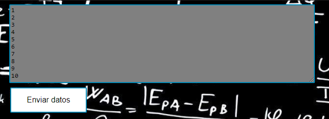

# Promedio y desviación estándar con Lista Enlazada

Este proyecto contiene la implementación del cálculo de promedio y desviación estándar de una muestra poblacional.
El cálculo es presentado en una página web apoyada sobre el framework spark.

## Empezando

Estas instrucciones te utilizar la página web, compilar el proyecto y las pruebas.
Las instrucciones se limitan a compilación, ejecución y uso. 

 
### Prerrequisitos

Para instalar y correr exitosamente este proyecto necesitamos:
* **Java**
* **Maven**
* **Git**


### Instalación

Primeramente vamos a descargar el repositorio en nuestra máquina local, y en la carpeta de 
nuestra preferencia. En consola vamos a digitar el siguiente comando para clonar el repositorio.

```
git clone https://github.com/alejovasquero/SparkWebApp---AREP
```

Entremos a el directorio del proyecto

```
cd SparkWebApp
```

Debemos compilar el proyecto, que contiene las clases necesarias para poder correr nuestro
proyecto. Por medio de maven vamos a crear todos los compilables **.class**. Desde consola, y ubicados en la carpeta donde se encuentra
nuestra configuración de maven.

```
mvn package
```

Ahora que nuestras clases etan compiladas vamos a ejecutar la clase principal para
ver el código en acción : )

## Spark local

Una vez compiladas las clases vamos a correr el proyecto

```
mvn exec:java -Dexec.mainClass="edu.escuelaing.arep.SparkWebApp"
```

Ahora vamos a entrar a nuestro browser en [localhost:4567/hello](localhost:4567/hello)

## Spark HEROKU

Si queremos hacer uso de la aplicación desde heroku entramos al siguiente [link](https://ancient-dusk-94293.herokuapp.com/hello)


## USO de la aplicación

Vamos a insertar una lista de datos válidos y recibir el resultado:
Una vez en la página /hello, vamos a insertar la lista de datos para cálcular.



Una vez los datos están completos damos en el botón de envío.
Ahora vamos a ser dirigidos a la página de resultados pata validarlos.


## Corriendo las pruebas

Correr las pruebas dentro del proyecto es muy sencillo, 
y lo haremos por medio de una fase de maven, la fase __test__, del ciclo de vida __default__. 

```
mvn test
```


### Detalle de las pruebas para la lista enlazada (LinkedListTest)
* **sizeTest** : Pruebas del tamaño que debe tomar al insertar y eliminar
* **addTest** : Pruebas de adición a la lista enlazada
* **shouldNotRemoveTest** : Casos en los que remover no debería ser efectivo
* **shouldRemoveTest** : Casos en los que remover debería ser efectivo
* **shouldInsertAll** : Caso de inserción para el método del la API *Collection*, de addAll


### Detalle de las pruebas para paquete de estadísticas (StatisticsPackageTest)
* **shouldCalculateMean** : Pruebas con archivos de prueba con datos muestrales, y cálculo de promedio esperado
* **shouldCalculateDeviation** : Pruebas con archivos de prueba con datos muestrales, y cálculo de desviación estándar


### Detalle de las pruebas para la clase HTMLHandler
* **openTest** : Pruebas con archivos de prueba con strings almacenados
* **replaceTest** : Pruebas con archivos de prueba con string, donde se hacen reemplazos en las palabras obtenidas

## Construido con


* [Maven](https://maven.apache.org/) - Manejo de dependencias
* [Git](https://git-scm.com/) - Control de versiones
* [Java](https://www.java.com/es/) - Lenguaje de programación
* [Spark](http://sparkjava.com/) - Framework de desarrollo web


## Autores

* **David Alejandro Vasquez Carreño** - *Trabajo inicial* - [alejovasquero](https://github.com/alejovasquero)

## Licencia

Este proyecto está licenciado bajo la licencia del MIT - Vea el [LICENSE.md](LICENSE.md) para más detalles

## Reconocimientos

* Victor S.Adamchik
